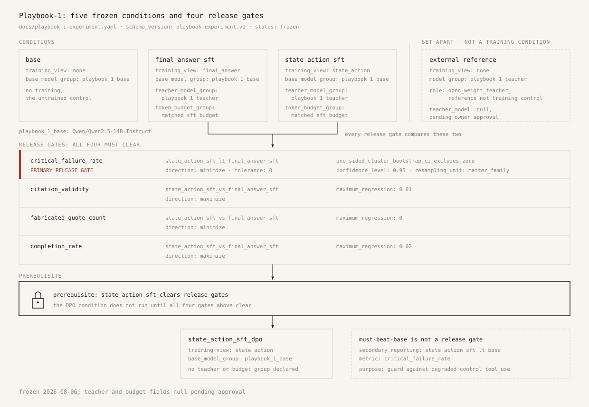
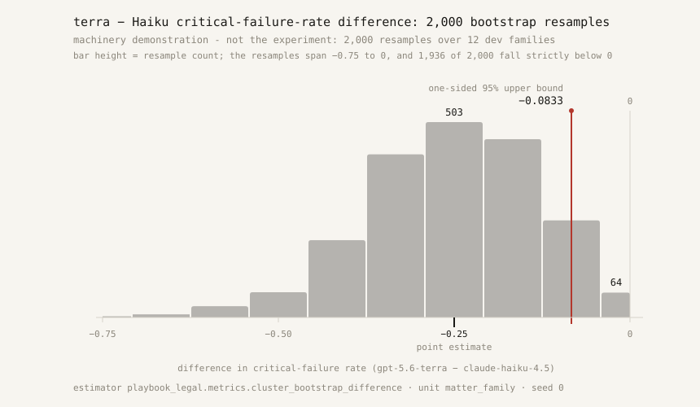
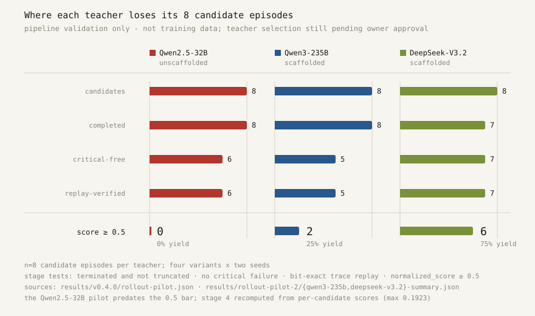

Three failures in an AI markup get a deal lawyer in trouble, and I have now measured all three — inside a synthetic gym of twelve fictional matters, scored deterministically against a lawyer-authored answer key. No real client file is involved anywhere in this post, and no score in it is a credential.

The first failure is silence. Against expert reference trajectories that average 2.67 client questions per matter and score 0.958 question recall, GPT-5.6-terra asked 0.42 questions per matter and Claude Haiku 4.5 asked 0.58, under per-matter budgets of three or four. Question recall was 0.083 for Haiku, 0.056 for terra, 0.021 for Qwen2.5-7B, and exactly 0.000 for Qwen2.5-14B and -32B. These are dev-split rows from the Playbook gym; the frontier and 32B rows are single seed, twelve episodes each, the frontier rows served through a commercial gateway with a 4,096-token output cap while the open-weight rows ran on self-hosted vLLM. And the reference is the answer key executing itself — a lawyer-authored trajectory replayed through the scorer — because no human baseline exists yet.

The second is the concession. On the buyer-side M&A matter, five of the seven open-weight runs proposed markup that gave away the survival, cap, and deductible allocation — the exact allocation the client's investment-committee mandate reserves. The model does not fail to know that a survival period matters; it fails to notice that this particular client said not to trade it. Both frontier rows cleared that matter — same dev split, same single-seed qualifier, and with twelve matter families the clustered intervals are wide and overlap heavily, so any ordering is suggestive, not established.

The third is fabrication: quoting language that is not in the file. All three open-weight fabricated quotations landed in rushed episodes of six, six, and five steps. Haste explains the small models. It does not explain Claude Haiku 4.5, whose four fabricated quotations came in episodes of fifteen, seventeen, and eighteen steps; GPT-5.6-terra, the other frontier row, fabricated none. One caveat travels with every failure *rate* in this post: those rates were measured under critical-failure gates I have since audited and replaced, and pre- and post-revision rates are not numerically comparable without a re-run. The underlying events — the concessions, the invented quotes — are real episodes, documented in [the baseline report](https://github.com/jamesbaker1/playbook/blob/main/docs/baseline-report.md).

None of these is a knowledge failure. Every one of these models knows what a liability cap is. They fail at process — at asking before drafting, at noticing what this client reserved. Capability is not the constraint here. Restraint is. Playbook-1 is the attempt to train that in, and this post is the unusual part: **the model does not exist yet.** What exists is the contract — the claim, the conditions, the primary metric, and the decision rule — frozen in a public file before any training data was generated, and implemented as code that runs and has tests.

## Why the claim comes before the run

Legal AI has an audit history. LawGeex announced in 2018 that its system beat experienced lawyers at NDA review, and the number traveled around the world while the conditions traveled later and more slowly. The GPT-4 bar-exam percentile of 2023 traveled further still, and was then substantially deflated by Martínez's 2024 reanalysis of the comparison population. A number announced first and specified afterward has no defense. Once you have the number, every subsequent choice about what it means — which comparison group, which metric, which caveats survive editing — is made by someone who already knows which answer they would prefer. Nobody has to be dishonest for the output to be unreliable.

The fix is ordering. Freeze the claim and the decision rule while you are still ignorant of the outcome; then run. In the lineage this borrows from, SWE-Gym turned an evaluation suite into a training environment for software agents, and Mercor's APEX corpus has already been used commercially by Applied Compute to post-train a model that tops its corporate-law leaderboard — the eval-to-training pipeline works. What that lineage mostly does not do is write the launch post first.

## The experiment

The design is a controlled comparison, not a demo. One teacher generates trajectories in the environment. Those trajectories are cut two ways into training data. The **state-action view** keeps every decision the teacher made — this observation, this action, out of the eleven action types the environment publishes. The **final-answer view** keeps only the final submitted summary. The two conditions optimize different objectives from the same episodes:

$$\mathcal{L}_{\text{final-answer}} = -\log p_\theta\!\left(y_{\text{final}} \mid o_0, D\right), \qquad \mathcal{L}_{\text{state-action}} = -\sum_t \log p_\theta\!\left(a_t \mid o_t\right),$$

where $D$ is the matter's visible document text. Same teacher, same student base model, same declared token-budget group. Then a decision-level DPO stage on same-state preference pairs, gated behind the SFT result.

In plain terms: two apprentices, one supervisor. One apprentice watches the whole matter get worked, decision by decision. The other reads the file and then only the closing summary the supervisor filed — matter in, final write-up out. Same supervisor, same hours. Does watching the work beat reading the output?

The frozen contract names the student — `Qwen/Qwen2.5-14B-Instruct`, approved on 2026-08-06 after the dev-split baselines, and the contract records that approval and its date. It declares exactly five conditions (base, final-answer SFT, state-action SFT, state-action SFT plus DPO, and an external teacher reference), and the validator fails if the set does not match exactly. The DPO condition carries a literal prerequisite, `state_action_sft_clears_release_gates`: I do not get to try the fancier method if the simpler one fails its own gates. Two honesty notes, because a hostile reader will find both: "matched token budgets" is currently enforced as string equality of a label both conditions declare — nothing yet measures the tokens each condition actually consumed — and the DPO prerequisite, like the held-out requirement, is a string in the file that no code reads.

Two rules govern what becomes training data. A record never leaks the consequence into the prompt — a record that does is teaching hindsight, not judgment. And review sampling is stratified rather than top-k, because selecting the highest-scoring path teaches the model to be lucky.

## The gates, printed

The primary metric is the critical-failure rate — the share of episodes containing at least one gate-tripping professional failure:

$$\mathrm{CFR}(c) = \frac{1}{|E_c|} \sum_{e \in E_c} \mathbb{1}\!\left[\text{critical failure in } e\right].$$

The primary release gate is a one-sided 95% cluster bootstrap on the paired difference, resampled by matter family, with tolerance zero:

$$\hat{U}_{0.95}\!\left(\mathrm{CFR}_{\text{state-action}} - \mathrm{CFR}_{\text{final-answer}}\right) < 0.$$

Each of the 2,000 replicates — the estimator's default; the resample count and seed are two knobs the contract does not freeze — draws one list of families with replacement and applies it to both conditions, so the comparison is paired by construction, and the code refuses to run if the two conditions do not cover an identical family set. The published bounds are rounded to four decimals before anything is decided, and the excludes-zero flag is derived from those rounded, printed bounds — the flag and the published numbers can never disagree.

Three guardrail gates block a release regardless of the primary result, comparing rounded condition means against fixed allowances rather than intervals:

$$\bar v_{\text{fa}} - \bar v_{\text{sa}} \le 0.01, \qquad \bar q_{\text{sa}} - \bar q_{\text{fa}} \le 0, \qquad \bar c_{\text{fa}} - \bar c_{\text{sa}} \le 0.02,$$

for citation validity $v$, fabricated-quote count $q$, and completion rate $c$. Zero tolerance on fabrication is the one that matters: a model that learns to fabricate more fluently does not ship, whatever it does to the headline number.

Three things I want on the record rather than discovered by a critic. The "must beat the unmodified base" comparison is secondary reporting in the frozen file, not a release gate — the code marks it reporting-only and excludes it from the pass aggregation. The plan's prose says the safety gates are judged against clustered intervals; the YAML and the code say rounded means, and the YAML and the code are what runs. And the DPO stage has no preregistered gate of its own, even though the plan calls the before-and-after DPO comparison the first test of whether environment feedback improves the student beyond teacher imitation.

## The decision rule is code, and I can run it today

`playbook-analysis` is a console entry point that reads every gate, comparison, allowance, and confidence level from the frozen YAML rather than from flags. The loader refuses any contract whose status is not exactly `frozen`. Pending means null in code: while teacher selection is `pending_owner_approval`, the `teacher_model` field must remain null, and there are tests named for the smuggling attempt they prevent. A missing metric column raises rather than defaulting to zero, on the stated principle that a release gate must not silently score an absent column as a perfect result.

Because it is code, I can demonstrate the machinery on real rows — and I want to be precise that this is a machinery demonstration, not the experiment. Neither trained condition exists. I fed the preregistered estimator the only paired data that exists today: the GPT-5.6-terra and Claude Haiku 4.5 scorecards, single seed, same twelve public dev matters, pre-revision instrument. On critical-failure rate (terra 0.000, Haiku 0.250), the one-sided 95% upper bound on the difference is $-0.0833$ — that is the gate's exact form, and it fires; the two-sided interval on the same rows is $[-0.5, 0.0]$ and touches zero, so even here the ordering is suggestive rather than settled. On normalized score, terra's advantage is 13.8 points — and the two-sided 95% interval is $[-0.0448, 0.3055]$: twelve families cannot settle even a 14-point score gap. There is also a floor built into the arithmetic: on the dev split every family is a singleton, and if the treatment is failure-free, the one-sided gate can only fire when the chance of resampling none of the failing families falls below 5% — which needs at least three critically-failing control families, since $(1 - m/F)^F \to e^{-m}$ and $e^{-3} \approx 0.0498$. That is the quantitative reason the frozen contract targets 15 to 30 sealed families and 50 to 100 episodes rather than twelve, and why the plan writes down that a floor-effect metric cannot demonstrate improvement. The demonstration is committed: `scripts/bootstrap_demo.py`, with its resample distribution at `results/bootstrap-demo/2026-08-19-terra-vs-haiku.json`.

Precision about the word *preregistered*. The contract was frozen before any record was reviewed or approved for training use — the one dataset build that predates it is labeled, in the repository, pipeline validation and not training data. It was not frozen before all measurement: the contract file, the first dev-split baselines, and the first rollout pilot landed in the same commit, and the student was chosen after seeing those baselines. The contract has been touched exactly twice in git history, and the second change touched only the execution block; the scientific block has not moved since it was written. The release post is already written in full, with literal placeholders that the frozen gates must fill — it stays in a private working directory until it publishes, which is the one link in this chain you have to take on trust. And here, before the run, I am committing to the stronger version: if the gates do not clear, there is no model release, and the filled-in numbers publish anyway, in the same slots.

## What is not decided, and what the pilots say

The teacher is null — `teacher_model_selection_status: pending_owner_approval` — and the note in the frozen file still names "a 70B-class open-weight teacher behind a hosted API," which neither piloted candidate quite fits.

Three pilots inform that decision without making it. Eight candidate episodes per teacher — four variants by two seeds, one temperature, one prompt, train split, no confidence interval on either pilot summary, and seed-to-seed spread on a single variant reached 0.73 normalized, larger than the gap between the two scaffolded teachers' means. With that deflation stated first: an unscaffolded Qwen2.5-32B produced 0 of 8 candidate episodes above the 0.5 normalized-score bar. With a scaffolded workflow prompt whose SHA-256 is recorded in both summaries, DeepSeek-V3.2 cleared 6 of 8 (mean 0.509) and Qwen3-235B cleared 2 of 8 (mean 0.378), against reference replays of 0.969 to 1.000 on the same four variants — references that are the answer key replaying itself, and means that mix a clamped 0.000 with a 0.25 critical cap, so they are not arithmetic on a continuous quality scale. The 32B comparison changed the model, the prompt, and the serving path at once, so the scaffold's own contribution is not isolated. What is visible: all sixteen scaffolded episodes read every available document; DeepSeek asked client questions in all eight episodes and ran 24 to 30 steps (it hit the 30-step budget twice, so that is a lower bound) where the unscaffolded 32B averaged 8.5 and asked none.

A candidate trajectory survives only if it passes four stages in order — completed without truncation, critical-failure-free, bit-exact replay-verified, and at or above the 0.5 score bar:

$$y = \frac{S_4}{S_0}, \qquad \kappa = \frac{\text{spend}}{S_4},$$

and when $S_4 = 0$, as it was for the 32B, the cost per usable trajectory is not a large number — it is undefined. "Cleared the fabrication trap" also deserves its exact meaning: it put no non-verbatim string in the `quotes[]` field; an identical fabricated attribution asserted in analysis prose is not gated at all, which the repository calls the cheapest available reward hack in the environment today. What still fails is instructive: every critical failure across both scaffolded teachers was a verbatim-verifier catch on an invented quotation, and seven of DeepSeek's eight episodes asserted at least one unsupported issue while only one fabricated a quote.

The economics are asymmetric in a way worth stating exactly. The recorded pilot spend was $0.235 for Qwen3-235B and $0.523 for DeepSeek — about $0.087 per surviving trajectory at DeepSeek's yield — though those dollar figures are recorded assertions in the summaries, without token-level backing. The 32B pilot's $0.31 was Modal GPU rent, not API tokens, so it is not even the same kind of number. Scaling from the one measured dataset build — ten state-action records per surviving trajectory, measured on the 32B's short episodes and therefore a conservative basis for DeepSeek's longer ones — the plan's 2,000-to-5,000-record target needs 200 to 500 survivors, roughly 267 to 667 generated episodes at DeepSeek's 0.75 yield, on the order of $17 to $44 of teacher tokens. The same target implies 30 to 150-plus hours of qualified legal review at one to two minutes per record. The teacher inference for a Playbook-1-sized dataset costs less than dinner; every serious cost in this project is a lawyer's time, and no amount of cheaper inference touches it. The budget field in the contract is null and stays null until approved.

The frontier rows do not solve this, and the contract is explicit about why: the external-reference condition is marked `open_weight_teacher_reference_not_training_control`. Frontier rows are the ruler, not the source — I want weights I can point at, a license I can read, and a provenance line I can write into a data card.

The sealed evaluation corpus is unfinished. As of 2026-08-08, six families are owner-reviewed against an interim floor of ten; five more were drafted and then blocked at adversarial pre-review with ten blockers, every one reproduced twice by engine replay. The public registry ships zero sealed identifiers and zero hashes today; the mechanism to publish identifiers and SHA-256 content hashes without contents exists in code and is tested, and the artifact ships when the corpus clears review. Until then, the contract's held-out requirement is enforced by discipline, not by the CLI — the tool will not stop you from ignoring it, which is exactly the kind of sentence I would rather write about myself than read in someone else's audit.

## The audit happened in the right order

Ordering already paid off once. In August I ran an adversarial probe against the gym's own critical-failure gates — the preregistered primary metric — before any training run existed. It replay-confirmed 84 blocker-grade and 52 major false positives across the eleven gated public matters and the variant specs, bare regexes failing correct, playbook-compliant lawyering, plus 100 cataloged dodges going the other way. The tracked summary is blunt: "the instrument currently penalizes careful lawyering more reliably than it catches careless lawyering." The fix shipped as a declared instrument revision — 116 of 121 shipped gate entries now carry structured guards, a 406-entry probe regression suite runs against the live rubrics, and the comparability note says plainly that post-revision rates are not comparable to the v0.4.0 rows without a re-run. The evidence record is published at [docs/instrument-audit-2026-08.md](https://github.com/jamesbaker1/playbook/blob/main/docs/instrument-audit-2026-08.md). That is uncomfortable to write, and it is the point: the primary metric got audited before any training run produced a number anyone would want to defend. Preregistration is what made the order possible.

## How to check me, and what would make me wrong

The contract is [`docs/playbook-1-experiment.yaml`](https://github.com/jamesbaker1/playbook/blob/main/docs/playbook-1-experiment.yaml), and its git history is two commits long. The decision rule is `playbook-analysis`, with its tests, in a suite of 1,255 at this release. The two scaffolded pilots are in `results/rollout-pilot-2/` and the 32B pilot in `results/v0.4.0/rollout-pilot.json`; the scaffold prompt is `training/scaffold_prompt.txt`, its SHA-256 recorded in both summaries. The summaries and their per-candidate digests are public, but the raw pilot traces are not in the repository — a gap in my own openness I would rather name than dress up. The same is true one level up: the v0.4.0 model rows shipped derived metrics without per-episode traces, so those baselines are not replayable by a reader today; the lawyer-authored reference is (`examples/*/good.jsonl`), and trace retention ships with the bench from here on.

What would make me wrong. If the one-sided upper bound does not clear zero, state-action distillation did not beat matched final-answer distillation on this metric, with this teacher, into this student — and I will say so in those words. If it clears zero while the protocol-failure secondary shows the final-answer control simply lost the ability to call tools, the win is an artifact, and the secondary exists to catch exactly that. If the sealed families lack enough temptation density that the base model's critical-failure rate sits on the floor, the comparison is uninformative rather than negative. A positive result generalizes to one teacher's trajectories, and until the post-DPO comparison runs, nothing here is evidence about reinforcement learning. Until the gates clear, the artifact is a Playbook-distilled workflow model, and I will not call it more than that.

This is a preregistration, not a finding. That is the only reason it is publishable today. The environment it all runs on — and the audit that bent its gates back into shape — is [the other post](https://deskofjim.com/blog/playbook/).
