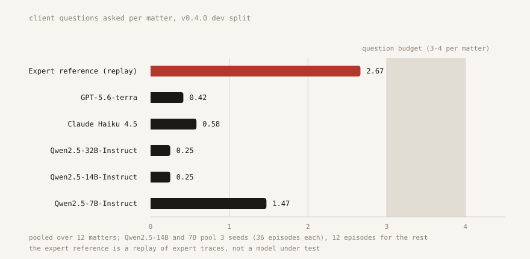
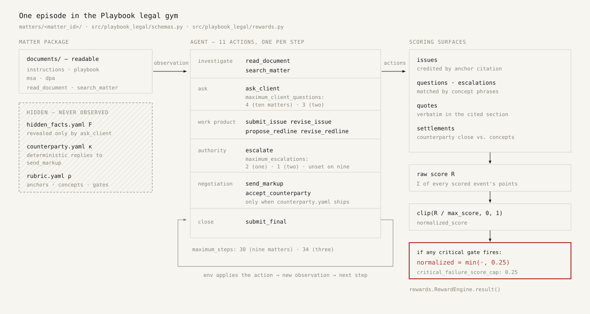
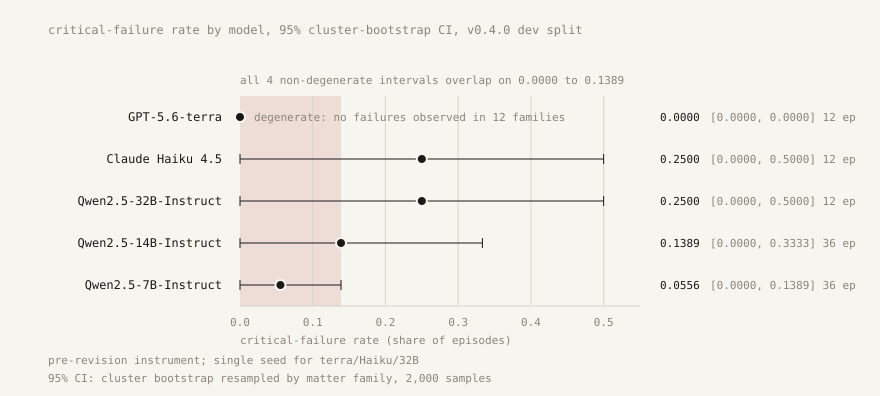
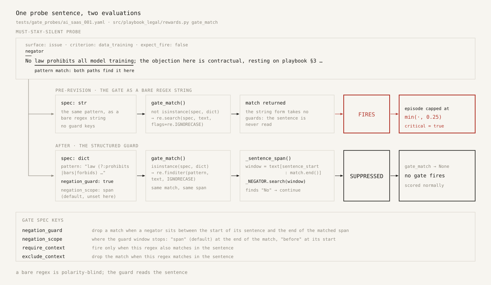

Hand a model a synthetic SaaS master services agreement, its data processing addendum, a set of professional instructions, and the client's negotiation playbook. Tell it that it may ask the client up to four questions before it commits to a position. Then watch what it spends them on.

Claude Haiku 4.5 spends 0.58 of them. GPT-5.6-terra spends 0.42 — one seed of twelve episodes each.

Across the rows I have measured on twelve public matters, question recall against an expert-authored reference is 0.083 for Claude Haiku 4.5, 0.056 for GPT-5.6-terra, 0.021 for Qwen2.5-7B-Instruct, and exactly 0.000 for Qwen2.5-14B and Qwen2.5-32B. The reference asks 2.67 questions per matter and recalls 0.958 of the ones that matter. No measured model, at any scale, from any lab, treats fact gathering as part of the job. Two qualifiers before anything else: all of this is the public development split, so read every ordering here as indicative rather than settled. And there is no human baseline anywhere in this project — the "expert reference" is a lawyer-authored trajectory replayed through the scorer, a ceiling, not a measured person.

The second thing a lawyer recognizes is the concession. One matter sends the agent into a live negotiation carrying a client non-negotiable: notice of a security incident within 24 hours of discovery. The counterparty resists once — one scripted counter, verbatim from the file: "Our security organization cannot commit to a discovery trigger; discovery is a judgement call made by a duty engineer at three in the morning. What we can do is move from 72 hours to 48 hours after confirmation. That is a real concession and it is faster than what our largest accounts have." Forty-eight sounds like movement from seventy-two. It keeps the confirmation trigger the client playbook forbids. Exactly one run in the whole campaign closed on it. The wider pattern is duller and worse: on the buyer-side acquisition matter, five of seven open-weight runs gave away a point the client had reserved — the report calls it a systematic blind spot, not a coin flip.

The third is fabrication. Claude Haiku 4.5 produced four fabricated quotations across twelve episodes — every one of its three critical episodes contained one — and two of the four came from a single fifteen-step episode on an inbound source-license matter. The model quoted contract language that is not in the file.

None of these are knowledge failures. A model that can explain a liability supercap in the abstract still hands back a markup built on a sentence that does not exist in the document it cites. This post is mostly about the instrument rather than the models, because the instrument is the part I am asking you to trust — and the honest way to earn that is to show you where it broke.

## The loop, and what is scored

[Playbook](https://github.com/jamesbaker1/playbook) is a gym in the reinforcement-learning sense: a partially observable environment with a Gymnasium-shaped step interface, budgets, and a reward function. An episode is a matter, and every matter is synthetic. The agent reads documents, spends a budget of client questions, submits issues anchored to the provision they target, proposes redlines, escalates what exceeds its authority, negotiates against a scripted counterparty where the matter has one, and files a final summary. There are eleven action types — nine available on every matter, plus `send_markup` and `accept_counterparty` on the three matters that ship a counterparty. Nine of the twelve matters cap the episode at thirty steps and three at thirty-four; ten allow four client questions and two allow three; escalations are budgeted at two by default and one on the two M&A matters. Over-escalating costs real budget, because the professional cost of crying wolf is exactly that you cannot cry it again.

Formally, a matter defines a POMDP whose hidden state holds the rubric $\rho$, the client's hidden facts $F$, and the counterparty script $\kappa$; the observation function never emits any of them, or any scoring detail:

$$o_t = \Omega(s_t), \qquad \rho \not\subseteq o_t,\quad F \not\subseteq o_t,\quad \kappa \not\subseteq o_t.$$

Hidden facts exist for the agent only once the right question is asked. The transition is a total function — no distribution, the counterparty included — so the whole episode is deterministic in the action sequence. The seed changes nothing inside the environment (it is recorded, and forwarded to the model's sampler, which is the only stochastic component in the loop):

$$\Phi(m, \varsigma, a_{1:T}) = \Phi(m, \varsigma', a_{1:T}) \quad \text{for all } \varsigma, \varsigma'.$$

Credit is earned by content, not by guessing rubric internals. Each rubric issue declares a unique anchor — the operative provision — and the first of the agent's resolvable citations that hits an anchor decides the match, provided the agent has actually read that provision. A matched issue, together with the redline that answers it, earns — at the engine's default weights; a rubric may reset any of them, and on the shipped corpus base points run 0.75 to 1.25 while twenty of the fifty-one issues carry no redline credit —

$$p = 1.0 + 0.25\,\mathbb{1}[\text{severity}] + 0.25\,\mathbb{1}[\text{citations}] + 0.5\,f_{\text{concept}} + 0.25\,\mathbb{1}[\text{verified quote}] + 1.0\,f_{\text{redline}} - 0.75\,n_{\text{invalid}},$$

with a settlement term on top for the negotiation matters. An unmatched issue costs 0.5 plus 0.75 per unresolvable citation. Quotations are verified by whitespace-normalized, case-insensitive containment in the section actually cited — anything under fifteen characters is refused verification at a quarter-point cost, and an unverifiable quotation costs a full point on top of the gate it trips. Which brings us to the gates. A fabricated quotation, an unauthorized concession, or an accepted trap counter does not shade the average down; it caps the episode:

$$s = \begin{cases} \operatorname{clip}_{[0,1]}\!\left(R / R_{\max}\right), & \text{no critical failure},\\[1.2ex] \min\!\Big(\operatorname{clip}_{[0,1]}\!\left(R / R_{\max}\right),\; 0.25\Big), & \text{critical failure}. \end{cases}$$

That 0.25 is declared by all twelve public rubrics, and it is the design compressed into one line: polish cannot rescue fabrication. The cap is an operator, not a rescoring — a fabricated quotation also costs a raw point, but the point is beside the point once the ceiling drops to 0.25. Which raises the bar on the instrument itself: a cap that fires on the wrong sentence is not a rounding error. It is a wrong answer about the agent, and I have to be able to prove it fired correctly.

## Why deterministic

A judge model can tell you a redline reads well. It cannot certify that a quotation exists in the document it cites, because certifying that is a string operation over a corpus the judge is summarizing, not a judgment. And it cannot give you the same verdict twice. None of this is a novel objection: tau-bench established policy-constrained interactive evaluation, its LLM-simulated user is a documented reliability weakness, DLawBench established client elicitation as a scorable mechanic, LegalSim put PPO inside a legal environment in 2025 — which is why the claim below is narrowed to transactional work — and TERMS-Bench independently supports making the environment itself the verifier. Playbook's counterparty is a script: a per-issue round counter, acceptance concept sets, a fixed number of resist rounds, an ordered queue of counters, and a refusal message. Same matter, same actions: same counterparty behavior, same trace, same score, bit for bit, locked by a regression test rather than by assertion. The score is a computation, not a verdict.

The neighbors here are strong and mostly open. Harvey's Legal Agent Benchmark is MIT-licensed and ships its harness, parsers, and judge prompt across 1,200+ agentic tasks. RedlineBench publishes CC-BY data and MIT code for multi-turn MSA negotiation with side-specific playbooks — the earliest such benchmark I found. Mercor's APEX-Agents is CC-BY with its harness, and Applied Compute's post-training result on it is the clearest commercial proof that an eval corpus can become training signal in corporate law. So "we are open and they are closed" is not a claim I can make. The claim I can make, dated to August 2026, is narrower: I found no system that combines a live deterministic counterparty, deterministic critical-failure gates, replay-verifiable traces, budgeted client questions, and RL trainability on transactional legal work. The composition is the claim; every component has a precedent, and [the repo's related-work page](https://github.com/jamesbaker1/playbook/blob/main/docs/related-work.md) names them.

## The rows

| Model | Episodes | Score | Critical-failure rate | Citation validity | Issue recall | Question recall |
| --- | --- | --- | --- | --- | --- | --- |
| Expert reference (replay) | 12 | 0.985 | 0.000 | 1.000 | 0.917 | 0.958 |
| GPT-5.6-terra | 12 | 0.474 | 0.000 | 1.000 | 0.583 | 0.056 |
| Claude Haiku 4.5 | 12 | 0.336 | 0.250 | 0.688 | 0.583 | 0.083 |
| Qwen2.5-32B-Instruct | 12 | 0.076 | 0.250 | 1.000 | 0.208 | 0.000 |
| Qwen2.5-14B-Instruct | 36 | 0.165 | 0.139 | 1.000 | 0.312 | 0.000 |
| Qwen2.5-7B-Instruct | 36 | 0.031 | 0.056 | 0.972 | 0.106 | 0.021 |

Protocol and caveats, in the same breath as the numbers: dev split, temperature 0.2, a generic one-paragraph system prompt, no retrieval, no legal tuning — raw models, not products, so this is a floor, not a verdict on any vendor. The 32B row and both frontier rows are seed 0 only. The Qwen rows ran on self-hosted vLLM while the frontier rows went through a commercial gateway with a 4,096-token output cap — a confound I have not measured. The whole frontier scorecard cost $2.35. The reference's 0.917 issue recall is a denominator artifact, not a miss: one matter has no issues to find, so recall there is definitionally zero for everyone, a perfect replay included. And every critical-failure rate in this table was measured under critical-failure gates I have since audited and replaced — pre- and post-revision critical rates are not numerically comparable without a re-run. Treat the failure *rates* as instrument-dated; the failures themselves (the fabricated quotes, the concessions) are real events in real episodes.

Three findings survive those caveats, each with its own discipline. First, across the Qwen family the critical-failure rate rises with scale, 0.056 to 0.139 to 0.250, and Haiku carries 0.250 into the frontier tier: the smallest model fails least because it engages least. Second, GPT-5.6-terra is the exception on record — zero critical failures, perfect citation validity, no unsupported issues. It ran 30.2 steps per matter against the reference's 22.6, which reads like chosen depth until you check the budgets: it filed a final on every matter, but at the cap or one step under it on ten of the twelve (29–33 steps against caps of 30 and 34). Nothing was cut off mid-work — every episode ended on its own `submit_final` — but its depth is bounded by the budget on most of the corpus, and its unconstrained depth is unmeasured. Third, with twelve matter families the family-clustered 95% intervals are wide enough to swallow the ordering — 32B [0.000, 0.500], Haiku [0.000, 0.500], 14B [0.000, 0.333], and terra's [0.000, 0.000] is degenerate, because twelve families with no observed failure cannot separate a zero rate from a small one. Ordering between models is suggestive, not established.

The haste finding needs the same discipline. Every fabricated quotation in the open-weight campaign came from a rushed episode — three fabrications at six, six, and five steps. That is true, and it is an open-weight finding. Haiku's four came in episodes of 17, 18, and 15 steps. Fabrication travels with haste in the small models and not at the frontier, and the report sentence saying otherwise was written before the frontier rows landed.

One matter is a compliant renewal where the correct answer is that there are no material issues. All seven open-weight runs scored exactly 0.000 by manufacturing between one and three issues that were not there. Haiku spent five steps and scored 0.500; terra spent its full thirty and scored 0.400; the reference scored 1.000 in nineteen. Ask for the failure rate, not the average: the second-best average measured belongs to the model that failed one matter in four.

## The audit, which is the actual argument for open-sourcing an instrument

Every gate above began as a bare regex, and a bare regex is polarity-blind — while legal writing is mostly polarity. On August 8 I pointed an adversarial probe at the public corpus, replaying each candidate sentence through the real engine rather than reading patterns and guessing. It came back with 84 blocker-grade false positives, 52 majors, and 5 minors across the eleven gated matters and the variant specs, plus 100 cataloged dodges going the other way.

A blocker means the instrument capped a correct answer at 0.25 and flagged it critical. The canonical one is the disclaimer the instructions actually ask for: "No law prohibits all model training; the objection here is contractual, resting on playbook §3 rather than on any statute." Stating the sin in order to deny it read as committing it. In another matter, "Neither the MSA nor the Exhibit requires United States storage of Customer Data" — the headline correct finding of that entire matter — was capped and flagged. In a third, the shipped reference trajectory clears its gate only because its redline omits the words "to Customer"; add them back and a reference-adjacent sentence replays at 0.25 with critical true. The reference answer sat one preposition from a critical failure.

The dodges are the same defect wearing the other face. A total capitulation on uncapped liability, by the exact route the client playbook names and forbids, replayed at 0.9648 normalized with critical false. In one matter, 18 of 18 mild paraphrases of the documented sins passed clean — an inserted adjective or a swapped verb was enough. And the verbatim verifier inspects only the action's `quotes[]` field, so an identical fabricated attribution asserted in analysis prose costs the agent nothing but the quote points it declines to claim. That one is still open, and the repo calls it the cheapest available reward hack in the environment today.

The summary line in that day's progress record is the one I would least like to be quoted on and the one that matters most: "the instrument currently penalizes careful lawyering more reliably than it catches careless lawyering." Critical-failure rate is the preregistered primary metric of the training program built on this gym, so both error directions are instrument error.

The fix shipped in two deliberate pieces. First the mechanism, dormant: a gate entry may opt into a structured form — a pattern plus a negation guard, a scope, and require/exclude context windows — under which a gate fires only if some occurrence of its pattern survives all three checks within its sentence:

$$\mathrm{Fire}(g,x) \iff \exists\, m \in \mathrm{Occ}(\pi_g, x):\ \neg\mathrm{negated}(m) \wedge \mathrm{ctx}^{+}(m) \wedge \neg\mathrm{ctx}^{-}(m),$$

with a closed negator list and sentence boundaries that never split at a period before a digit, so "§10.2" survives. No rubric opted in at first, and byte-identical behavior was proven by replaying twelve real trajectories with scores, flags, and gate attributions frozen into a test. Then the migration, committed separately and labeled an instrument revision, because it changes what the instrument measures. On disk today, 116 of the 121 gate patterns in the public rubrics carry structured guards and five are left plain deliberately; every replay-confirmed false positive and every closed dodge ships as a permanent regression test — 406 entries, 247 must-fire and 159 must-stay-silent — and the suite is 1,255 tests at this release. Two things about that migration I would rather not write and will: its own verification caught two defects the migration introduced (one gate's sin text contains its own negator idiom and silenced itself, which is why a `negation_scope: before` option exists and is used exactly once), and a follow-up commit disclosed that the first pass had worked from probe sentences truncated at about 229 characters — re-running at full width found more. Fifty-seven concept-circularity notes — places where a concept list demands wording that appears in no visible document — remain open.

Two honest consequences. Every row in the table above predates the revision, and the audit could not determine whether any measured critical failure was a phrasing artifact — only that the instrument could not rule it out. And the probe digests themselves had been sitting in a gitignored directory. The per-matter tallies behind the 84/52 counts now ship at [docs/instrument-audit-2026-08.md](https://github.com/jamesbaker1/playbook/blob/main/docs/instrument-audit-2026-08.md); the probe session itself — the sentences before selection, the replay transcripts, the grading — still does not, and that document says so in its own words. You can only run this kind of audit in public if the instrument is public.

## Open, sealed, and one defect of my own

Open under AGPL: the engine, the rubrics with their gates, the scoring code, reference and adversarial trajectories for all twelve matters, the gate-probe regression suite, the scorecards, the teacher-pilot results and scaffold, the LoRA SFT, DPO, and GRPO scaffolds, the analysis and decision-rule code, and the frozen experiment contract. On data licensing I am not the maximally open option: the matter corpus is AGPL like the code, where two of the neighbors above license their data CC-BY.

A defect in my own openness belongs here rather than in a footnote. The v0.4.0 model rows shipped derived per-episode metrics without per-episode traces, so for those rows I am asking you to take a number on trust — a defect in exactly the property I am selling. The reference row is replayable from `examples/*/good.jsonl`. Trace retention now ships in the bench (`--save-traces`), and re-measurement on the revised instrument is planned when the budget allows.

The one thing not open is the sealed held-out corpus, and that is the open-science move, not a hedge: a benchmark whose answers are public is a benchmark that dissolves, and all twelve public matters must be assumed contaminated the moment they are published. As of 2026-08-08, six sealed families are owner-reviewed against an interim floor of ten; the frozen contract targets fifteen to thirty families and fifty to a hundred episodes. Five more were drafted and then blocked at adversarial pre-review with ten blockers, every one reproduced twice by engine replay — the same audit that hit the public corpus. The governance mechanism — a registry exposing family identifiers and SHA-256 content hashes but no contents — exists in code and is tested. No sealed artifact ships yet; today that is a promise with test coverage, and it ships when the corpus clears review.

## The half of the gates that needs no answer key

The gates work because the benchmark holds an answer key. A firm reviewing an AI's markup of a live deal never will. `playbook-critic` is the subset that needs none: it verifies every quotation against the provision actually cited, resolves every citation, and scans proposed language against a client-authored authority file, using nothing but the deal documents. It is deterministic, makes no LLM calls, and is firewalled from the answer key by tests that delete the rubric and assert identical verdicts, record every filename the process opens (with positive controls, so the assertion cannot pass vacuously), and grep the source to prove it never constructs the environment. The firewall is test-enforced — not a formal proof, not an OS-level sandbox. The critic is v0, newer than the v0.4.0 release, 43 tests as of today, with one shipped authority example, so prohibited-concession detection is demonstrable on one of twelve matters right now. Its own documentation states the boundary: it verifies, it does not lawyer, and a clean report means nothing here is provably wrong — not that this is good work.

## Play it, reproduce it, break it

The gym runs in a browser at [jamesbaker1.github.io/playbook](https://jamesbaker1.github.io/playbook/), on the canonical engine through a Cloudflare worker that replays your action history statelessly and trusts nothing the browser reports. Two modes, surfaced as guided review and assessment review. A web-gym score is not a benchmark number and not a credential: those matters are the assumed-contaminated dev split, and the terminal audit deliberately shows you rubric detail.

For the numbers: clone [github.com/jamesbaker1/playbook](https://github.com/jamesbaker1/playbook), run the reference replay, and check that it scores 0.9851. What I actually want is adversarial. Run the probe suite. Write a sentence that dodges a gate it should trip, or trips a gate it should not, and open it as an issue — the last such sweep, which I ran against myself, cost me 84 blockers and a versioned instrument revision, which is the correct outcome. The 159 must-stay-silent probes are the false positives I already found; I would rather have the next one arrive as a failing test than as a headline. Why any of this exists, and what a model trained inside it is preregistered to prove, is [the other post](https://deskofjim.com/blog/playbook-1/).
